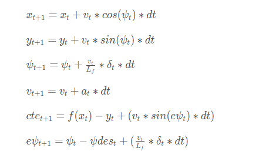

# CarND-Controls-MPC
Self-Driving Car Engineer Nanodegree Program

---

## The Model

We use Model Predictive Control to minimize the cross track and orientation errors of the vehicle with respect to a reference path drawn by a polynomial.  The state or the desired positioning of the vehicle is set to the center of the road.  

We predict the state and apply the control inputs, once the vehicle moves into the predicted state, we repeat the process of predicting the state and applying the control inputs (this creates our state feedback loop).  

**State**

- x, y = cars position in coordinates transformed from map coordinates
- ψ (psi) = vehicle's orientation
- v = velocity

**Actuators**

- δ (delta) = steering angle
- a = acceleration/braking

To mimic realistic driving behavior,
- Lower and Upperbounds for steering angles are constrained within -25 and 25 degrees converted to radians (MPC.cpp, line 180-186).
- Acceleration can be between -1 and 1, <0 implying braking and >0 implying acceleration (MPC.cpp, line 188-193).

**Cost Functions**

    // The part of the cost based on the reference state.
    for (int t = 0; t < N; t++) {
      fg[0] += CppAD::pow(vars[cte_start + t] , 2);
      fg[0] += CppAD::pow(vars[epsi_start + t], 2);
      fg[0] += CppAD::pow(vars[v_start + t], 2);
    }

We want cte and epsi to be close to 0 as possible.  Using Ipopt, the function is optimized through calculating the aggregate cost.  We tuned the model by putting more emphasis to correct cte and epsi, in this case I've multiplied both variables by 2000 times the original value.  

    // Minimize change-rate.
    for (int t = 0; t < N - 1; t++) {
      fg[0] += CppAD::pow(vars[delta_start + t], 2);
      fg[0] += CppAD::pow(vars[a_start + t], 2);
    }

    // Minimize the value gap between sequential actuations.
    for (int t = 0; t < N - 2; t++) {
      fg[0] += CppAD::pow(vars[delta_start + t + 1] - vars[delta_start + t], 2);
      fg[0] += CppAD::pow(vars[a_start + t + 1] - vars[a_start + t], 2);
    }

Here we optimize the control to make inputs more consistent and smooth, and adjust the time between actuations.  

**Update Equations**

This is the model followed.  The equations calculating t+1 are slightly edited based on a few assumptions:

- calculating x and y positions in the next timestep knowing the initial x and y values are 0, thus omitting these variables from the equation.  
`px = v*cos(delta)*latency;
py = v*sin(delta)*latency;`
- the orientation is negative because turning left is a negative sign in the simulator but represented as positive yaw for the MPC.
`psi = -v/Lf*delta*latency;`
- velocity, the speed 1 time step after v[t], equation remains unchanged
- cross track error, difference between the line and the current vehicle position y, equation remains unchanged
- orientation error, desired orientation subtracted from the current orientation, equation remains unchanged

Using the initial state, model, constraints and cost functions, the Ipopt solver returns a vector of control inputs (δ and a) that minimizes the cost function.  

## Timestep Length and Elapsed Duration (N & dt)

**N (timestep length)**

High values of N makes the cost function much more computational and more difficult to solve for the optimal solution.  I found that a timestep of 10 is a good medium to gather the necessary information to plot a good path.  Given the environment, it wouldn't be efficient to have higher values of N to predict the state further into the future.  

**dt (elapsed duration between timesteps)**

Ideally, dt should be minimized as much as possible.  Without latency, the car runs smoothly at a dt value of 0.05.  However, adding latency caused the car to oscillate left and right excessively because it wasn't able to quickly process the actuations optimally.  Although the car is still able to make it through the track, it would be a very unpleasant experience any passenger.  To compensate for the additional latency, adding 100ms to dt (0.15 dt) provides sufficient time elapses between actuations.    

## Polynomial Fitting and MPC Preprocessing

- The MPC trajectory is displayed in green
- A polynomial fitted reference path is displayed in yellow

## Model Predictive Control with Latency

Latency is handled by predicting the state of x, y, psi and velocity 100ms in the future, and using this information to process through the MPC solver.  This way the control inputs are synced 100ms in the future.  
